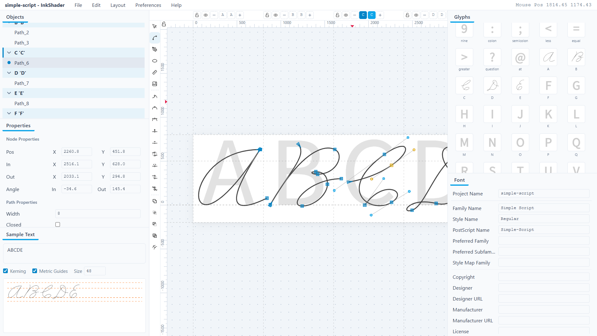

# InkShader

[中文](README.zh-CN.md)

InkShader is a lightweight font editor intended to help calligraphers create handwriting-style fonts.

*InkShader is in early development and may have some issues.*

## Availability

InkShader comes in three forms:

| Form | Description |
|------|-------------|
| Online | Visit `app.inkshader.com` and start immediately. The online version does not include the binary font export features powered by fonttools. |
| Desktop | Download the full desktop application. |
| Browser | Download the full version and run it in your browser. |

## Interface and Layout

The interface is composed of components. Use layout to choose which components are shown; drag a component's edge or title bar to rearrange the layout.

The canvas is the area where glyphs are drawn. Before drawing, specify the target glyph through the glyph sequence at the top of the canvas.

The toolbar on the left side of the canvas is used to select editing modes and run path operations. If the screen is too short to show the whole toolbar, place the cursor over the toolbar and scroll the mouse wheel to reach every tool.

### Canvas View

| Action | Shortcut / Mouse |
|--------|------------------|
| Zoom centered on the cursor | Ctrl + wheel |
| Zoom centered on the screen | Alt + wheel, or Ctrl + `+` / `-` |
| Pan | Ctrl + Left/Right arrow; middle-button drag; scroll the wheel over the ruler |
| Rotate | Alt + left-button drag, or Alt + Left/Right arrow |

Rotating the canvas makes the ruler display inconsistent with the actual coordinates.

## Glyphs

### Glyph Sequence

Multiple glyphs can be added to the glyph sequence. They are displayed in order on the canvas, each occupying its own advance width.

- Newly drawn paths belong to the active glyph.
- Actions such as editing an existing path or clicking the corresponding position in the sequence automatically make that glyph active.
- A glyph can be removed from the sequence. Removing it does not delete its data; it can be added back through the glyphs component.
- The edit menu switches how ruler coordinates are displayed when multiple glyphs are present.

### glyphs Component

The standalone glyphs component in the interface is the same component as the “click to add glyphs” button in the sequence. It contains common characters. New glyphs can be added manually, and those newly added glyphs can be deleted manually in the glyphs component.

### Names and Codepoints

A glyph has two attributes: name and codepoint. The name is the glyph's unique identifier; the codepoint may be empty. An empty codepoint usually means the glyph is a substitute glyph or a component. In the software's logic, glyphs with and without codepoints are not distinguished.

Glyph names and path/object names both have format requirements. A rename attempt that does not meet them is automatically cancelled.

### References and Components

There are two ways to add a glyph to another glyph as a component:

- Copy its reference and paste it into the target glyph's menu item;
- Drag the glyph directly into the target glyph.

Note the difference: dragging an ordinary object item into another glyph moves that object, whereas dragging a glyph into another glyph creates a reference to the former inside the latter. A reference object is essentially equivalent to a path for object-level transforms, but editing its nodes is synchronized directly to the original glyph and all its other references. A reference can be unlinked from its original glyph.

### Locking and Hiding

Glyphs can be locked and hidden; locking or hiding applies to all paths inside the glyph.

## objects and properties

All glyphs and paths present on the canvas are shown correspondingly in the objects component. Right-clicking an item in objects or an empty area of the canvas brings up the action menu.

The properties component holds the common properties at three levels: glyph, object, and node.

- It always shows the properties of the active glyph, the selected object, and the selected node; when the selection list is empty, nothing is shown.
- When more than one item is selected, some properties show a shared value (if one exists) and others show the value of one of the objects; if neither applies, the property item is disabled.
- For numeric properties, editing the value of a single object still applies the same delta to all selected objects.

For every text box in the interface, moving input focus away from the text box saves its content.

## Editing Modes

Five editing modes are available at the upper-left of the canvas:

1. Select
2. Node
3. Pen (Bezier curves)
4. Ellipse/Circle (fitted with a four-point Bezier curve)
5. Measure

### Pen and Ellipse

The pen and the ellipse are the two main ways to create paths. Right-clicking their icons opens a settings menu where some key properties of the path to be drawn can be specified in advance.

The pen follows the same interaction logic as in common graphics editors. The ellipse does too; holding Ctrl constrains the drawn ellipse to a circle. Once an ellipse is finished, a Bezier path with nothing special about it is created, not a special ellipse object.

Even if the pen is set to draw open curves, when the last clicked node is connected back to the start point, the path still closes automatically and drawing ends. Otherwise, press Esc or right-click on the canvas to end drawing.

### Node Editing

Switching to node mode displays the nodes contained in every path drawn earlier on the canvas. Control points stay hidden unless a main node in the same path is selected. Selecting a main node also adds its path to the path selection list.

All main nodes have three smoothness modes: corner, smooth, and symmetric. They can be set with the corresponding tools in the left toolbar, which changes the property of all selected nodes at once.

Right-clicking a control point deletes it.

There are several ways to multi-select nodes:

- Hold Ctrl and click nodes repeatedly;
- Drag a selection box in an empty area away from nodes;
- Place the cursor over a node and scroll up or down to select/deselect nodes in their order within the path.

### Node Snapping

Different kinds of node snapping can be toggled in the edit menu:

- Without Ctrl held, a main node can automatically snap to the same position as another main node when it comes close;
- A stronger snapping can also be enabled, snapping a main node to a fully horizontal or vertical position when it comes close to a horizontal or vertical line centered on another main node;
- With Ctrl held, dragging a main node constrains it to a horizontal or vertical position relative to its original position; dragging a control point constrains the angle of the control handle to a multiple of 5 degrees, to the angle of the other control handle, or to the angle of a control point of another main node located near the main node.

Ctrl snapping cannot be turned off; in other words, not pressing Ctrl means the feature is off.

### Inserting and Deleting Nodes

- **I**: insert a node at the t-midpoint of every selected segment. A segment is selected if and only if both of its end main nodes are selected. In addition, double-clicking anywhere on a curve segment inserts a node at that position. Inserting a node never breaks the curve shape.
- **D**: delete all selected nodes. The remaining nodes automatically try to fit the curve shape from before the deletion, but affect at most the two segments directly connected to the deleted node.

Inserting and deleting nodes both break the symmetric-level symmetry of the nodes at both ends, but not their smooth-level symmetry.

### Joining and Breaking Segments

- **Join selected end nodes**: merges two end nodes into one, positioned at their midpoint. If more than 2 end nodes are selected, they are paired up in traversal order.
- **Break path at selected nodes**: splits one node into two, each inheriting the control points on one side. The whole path goes from closed to open, or becomes two paths.
- **Add segment between selected end nodes**: inserts a segment between two end nodes, inheriting the existing end control points (if any). This closes an open path or merges two paths into one. Likewise, selecting multiple nodes attempts to pair them up.
- **Delete segment between selected nodes**: deletes every selected segment without deleting any nodes.

### Select Mode and Object Transforms

Switching to select mode allows editing paths and reference objects at the path object level:

- Click a path's fill area to select it, or drag its fill area to translate it;
- Hold Shift and click to multi-select paths;
- A marquee can also be dragged in an area with no path fill to multi-select paths; a path is added to the selection list only when its fill area is fully enclosed.

When selected, a path's bounding box has handles around it for scaling and deforming the path. Clicking again switches to rotate/shear mode. The bounding box of multiple selected paths is shown as the horizontal rectangular convex hull of all of them. Numeric path properties in the properties component are always properties of this box.

As in node editing: holding Ctrl while translating a path keeps it horizontal/vertical, rotating a path limits it to specific angles, and scaling a path preserves its original proportions. An additional feature can be enabled in the edit menu, after which dragging a path automatically enables snapping for all nodes in that path.

## Paths, Stroke, and live stroke

A path has an open/closed property; whether it has a fill depends only on whether it is closed. A path also has a stroke width property.

Stroke width does not exist as a property in font design. To create curves of uniform width, the stroke expand algorithm must therefore be applied to every curve that should have a stroke width, which destroys the original node data of the curve. The live stroke feature automates this process:

- A path with live stroke enabled has the stroke expand algorithm applied automatically at the rendering layer, while its original node data is kept for frontend editing;
- When exporting to a font product, every path with live stroke enabled has the stroke expand algorithm applied before export.

Consequently, a path that has a stroke width but does not have live stroke enabled renders differently on the canvas than it exports; conversely, the software guarantees that canvas rendering is basically equivalent to the export result.

Path boolean operations automatically apply the stroke expand algorithm to every live stroke path and discard the stroke width property of the remaining paths.

All paths within each glyph are composited with the nonzero winding rule. A path contains only one independent (possibly cyclic) doubly linked list, so boolean operations / expand stroke may turn one path into several when holes are present. Boolean operations cannot be performed across glyphs.

## Measure Tool and Guides

The **measure tool** creates auxiliary measuring rulers. Double-clicking a created ruler lets you set its numeric properties; right-clicking a ruler deletes it.

**Guides**: drag from the ruler onto the canvas to create a guide, and double-click it to set its properties precisely; dragging a guide back into the ruler area deletes it.

In addition, the canvas has a vertical divider and a horizontal metric guide for separating glyphs. The latter is an important part of the font file, while dragging the former directly changes the advance width of the glyphs on both sides. Both can be locked or disabled in the edit menu; the lock button at the upper-left of the canvas locks/disables ruler-level guides.

## Importing Images

The image import feature can import images. Imported images are not yet saved in the file.

## Other Components

- **sample**: previews the rendering result of a given text.
- **font**: edits font metadata; some properties are synchronized directly to the canvas.
- **kerning**: adds kerning data. Only simple one-to-one kerning is supported for now.
