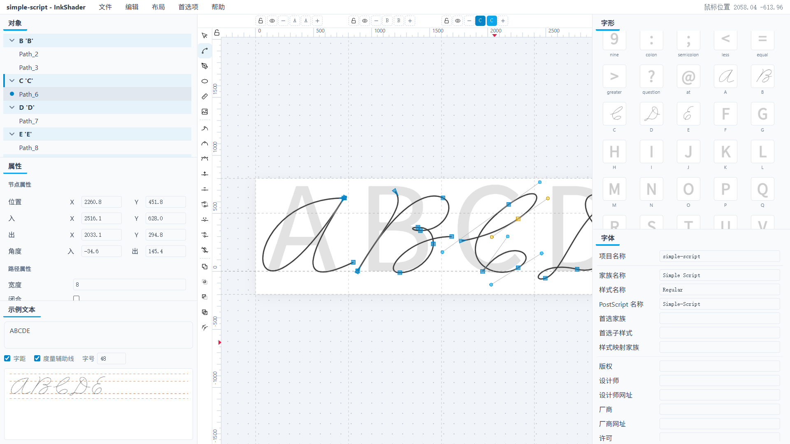

# InkShader

[English](README.md)

InkShader 是一个轻量字体编辑器，目标是帮助书法家创建手写风格的字体。

*InkShader 仍处于早期开发阶段，可能存在一些问题。*

## 使用方式

InkShader 提供三种使用方式：

| 方式 | 说明 |
|------|------|
| 在线版 | 访问 `app.inkshader.com` 立即开始使用。在线版不包含由 fonttools 支持的二进制字体导出功能。 |
| 桌面版 | 下载完整的桌面程序。 |
| 浏览器版 | 下载完整版本并在浏览器中运行。 |

## 界面与布局

界面由多个组件构成。可在「布局」菜单中选择需要显示的组件；拖动组件边缘或标题栏可以重新排列布局。

画布是绘制字形的区域。开始绘制前，需要先通过画布顶端的字形序列指定目标字形。

画布左侧的工具栏用于选择编辑模式和执行路径处理命令。若屏幕高度不足导致工具栏显示不完整，可将光标置于工具栏上滚动鼠标滚轮以查看全部工具。

### 画布视图操作

| 操作 | 快捷键 / 鼠标 |
|------|---------------|
| 以光标为中心缩放 | Ctrl + 滚轮 |
| 以屏幕为中心缩放 | Alt + 滚轮，或 Ctrl + `+` / `-` |
| 平移 | Ctrl + 左/右方向键；鼠标中键拖动；在标尺上滚动滚轮 |
| 旋转 | Alt + 鼠标左键拖动，或 Alt + 左/右方向键 |

旋转画布会导致标尺显示与实际坐标不一致。

## 字形

### 字形序列

字形序列中可以添加多个字形，它们按顺序排列，各自占据其步进宽度显示在画布上。

- 新绘制的路径归属于当前活跃的字形。
- 编辑已有路径、点击序列中对应位置等操作会自动将该字形切换为活跃。
- 可从序列中移除字形。移除不会删除其数据，可通过「字形」组件将其添加回来。
- 「编辑」菜单可切换存在多个字形时标尺坐标的显示逻辑。

### 「字形」组件

界面中的独立「字形」组件与画布序列中的「点击添加字形」按钮是同一个组件。该组件包含常用字符；可以手动添加新的字形，也可以在「字形」组件中手动删除这些新添加的字形。

### 名称与字码

字形具有名称和字码两个属性。名称是字形的唯一标识符，字码可以为空。字码为空通常意味着该字形是一个替换字形或组件；软件逻辑并不区分有无字码的字形。

字形以及路径/对象的名称均具有格式要求，不符合格式要求的改名尝试会被自动取消。

### 引用与组件

将字形作为组件添加到另一个字形有两种方式：

- 拷贝其引用并粘贴至目标字形的菜单项；
- 直接将字形拖入目标字形。

注意两者的区别：将普通对象项拖入其他字形会移动该对象，而将一个字形拖入另一个字形会在后者中创建一个前者的引用对象。引用对象在对象级别的变换操作上基本等价于路径，但其节点编辑会直接同步到原字形及其所有其他引用。引用可以解除与原字形的关联。

### 锁定与隐藏

可以锁定或隐藏字形，该操作会作用于其中的所有路径。

## 「对象」与「属性」

画布中存在的所有字形和路径都会对应显示在「对象」组件中。在「对象」的项上或在画布空白处右键均可唤出操作菜单。

「属性」组件包含字形、对象和节点三个级别的常用属性：

- 始终显示活跃字形、选中对象和选中节点的对应属性；选中列表为空时不显示。
- 选中数量大于 1 时，部分属性显示共用值（若存在），部分属性显示其中某一个对象的值；两者都不满足时，该属性项被禁用。
- 对于数值属性，修改单个对象的值仍会以相同的变化量同步到所有选中对象。

对界面中所有文本框而言，输入焦点离开文本框都会自动保存其内容。

## 编辑模式

画布左侧上方提供五种编辑模式：

1. 选择
2. 节点
3. 钢笔（贝塞尔曲线）
4. 椭圆/圆（用贝塞尔曲线四点拟合）
5. 测量

### 钢笔与椭圆

钢笔和椭圆是两种主要的创建路径的方式。右键这两者的图标会弹出设置菜单，可提前指定绘制路径的部分关键属性。

钢笔的操作逻辑与常见图形编辑器相同。椭圆亦然；按住 Ctrl 时，绘制的椭圆被限定为圆。椭圆绘制完成后，创建的是一个没有特殊之处的贝塞尔曲线路径，而不是特殊的椭圆对象。

即使将钢笔设置为绘制开放曲线，在试图把最后一次点击创建的节点连回起点时，路径仍会自动封闭并结束绘制。其他情况下，按 Esc 键或在画布上按鼠标右键结束绘制。

### 节点编辑

切换为节点模式后，画布会显示先前绘制的所有路径中包含的节点。控制点默认隐藏，除非同一路径中存在被选中的主节点。选中主节点会同时将其所属路径加入路径选择列表。

所有主节点具有三档平滑模式：角点、平滑点、对称点。可在左侧工具栏使用对应工具设置，该操作会一次性更改所有选中节点的属性。

右键控制点可以将其删除。

多选节点有以下几种方式：

- 按住 Ctrl 多次单击点选节点；
- 在非节点的空白处拖动选框；
- 将光标置于节点上并上下滚动滚轮，按同一路径中的节点顺序依次选中/取消选中节点。

### 节点吸附

可在「编辑」菜单中开关不同类型的节点吸附：

- 未按下 Ctrl 时，可让主节点在靠近时自动吸附到其他主节点的相同位置；
- 还可开启更强的吸附，使主节点在靠近以其他主节点为中心的横线或竖线时，吸附到完全水平或垂直的位置；
- 按下 Ctrl 时，拖动主节点会将其限制在与原位置水平或垂直的位置；拖动控制点则会将控制手柄的角度限制为 5 度的整数倍、另一个控制手柄的角度，或与主节点处于相近位置的另一个主节点的控制点的角度。

Ctrl 吸附无法关闭，即不按 Ctrl 键就是关闭该功能。

### 插入与删除节点

- **I**：在每个选中段的参数中点插入一个节点。一个段为选中段，当且仅当其两端主节点都被选中。此外，在曲线段任意位置双击也可以在该位置插入节点。插入节点永远不会破坏曲线形状。
- **D**：删除所有选中节点。剩余节点会自动尝试拟合删除前的曲线形状，但最多只影响与被删除节点直接相连的两段曲线。

插入和删除节点都会破坏两端节点的对称点级别对称性，但不会破坏平滑点级别对称性。

### 段的连接与断开

- **连接选中的端节点**：将两个端节点合并为一个节点，新节点位置取两者中点。若选中的端节点数量大于 2，则按遍历顺序两两配对。
- **在选中节点处断开路径**：将一个节点分裂为两个，各自继承一侧的控制点。整个路径由封闭变为开放，或直接变成两个路径。
- **在选中的端节点之间添加段**：在两个端节点之间插入段，继承现有的末端控制点（若有）。这会使开放路径封闭，或使两个路径合并为一个。同样地，选中多个节点时会尝试两两配对。
- **删除选中节点之间的段**：删除每个选中段，但不删除任何节点。

### 选择模式与对象变换

切换为选择模式后，可按路径对象级别编辑路径和引用对象：

- 单击路径填充区域选中路径，或拖动路径填充区域平移路径；
- 按住 Shift 单击可多选路径；
- 也可在无路径填充处拖动选框多选路径，必须完整选中路径填充区域才会将其加入选中列表。

选中时，路径选框四周有用于缩放形变路径的手柄。再次单击可切换为旋转/横切模式。多个选中路径的选框显示为所有这些路径的水平矩形凸包。「属性」组件中路径的数值属性永远是该选框的属性。

与节点编辑类似：按住 Ctrl 平移路径会保证水平/垂直，旋转路径会限制为特定角度，缩放路径会维持原比例。在「编辑」菜单中还可额外开启一项功能，开启后拖动路径会自动对路径中的所有节点启用吸附。

## 路径、描边与实时描边

路径具有开放/封闭属性，是否具有填充仅取决于是否封闭。路径还具有描边宽度属性。

字体设计中不存在描边宽度这一属性。因此，为了创建宽度均匀的曲线，必须对所有希望具有描边宽度的曲线应用展开描边算法，而这会破坏原曲线的节点数据。实时描边功能即用于自动化这一过程：

- 启用了实时描边的路径会在渲染层自动应用展开描边算法，同时保留原路径的节点数据供前端编辑；
- 导出为字体产物时，所有开启实时描边的路径都会先自动应用展开描边算法再导出。

因此，具有描边宽度但未开启实时描边的路径，其画布渲染效果与最终导出效果将不一致；反之，软件保证画布渲染效果基本等价于导出效果。

路径布尔运算会自动对每一个实时描边路径应用展开描边算法，并丢弃其余路径的描边宽度属性。

每个字形内部所有路径叠加计算非零绕数。一个路径只包含一个独立的（可能循环的）双向链表，因此当存在洞时，布尔运算/展开描边可能将一个路径变成多个。无法跨字形进行布尔运算。

## 测量工具与辅助线

**测量工具**用于创建辅助测量尺。双击创建的尺子可设定其数值属性，右键尺子可将其删除。

**辅助线**：从标尺上拖动到画布中即可创建辅助线，双击同样可以精确设置属性；将辅助线拖回标尺区域会将其删除。

此外，画布上还存在用于分隔字形的垂直分隔线和水平度量辅助线：后者是字体文件的重要组成部分，而拖动前者会直接更改两侧字形的步进宽度。这两者可在「编辑」菜单中锁定或禁用；画布左上角的锁按钮可用于锁定/禁用标尺级辅助线。

## 导入图片

图片导入功能可以导入图片。导入的图片暂未保存在文件中。

## 其他组件

- **示例文本**：预览指定文本的渲染结果。
- **字体**：编辑字体元数据，部分属性会直接同步到画布。
- **字距**：添加字距数据，暂只支持添加简单的一对一字距。
